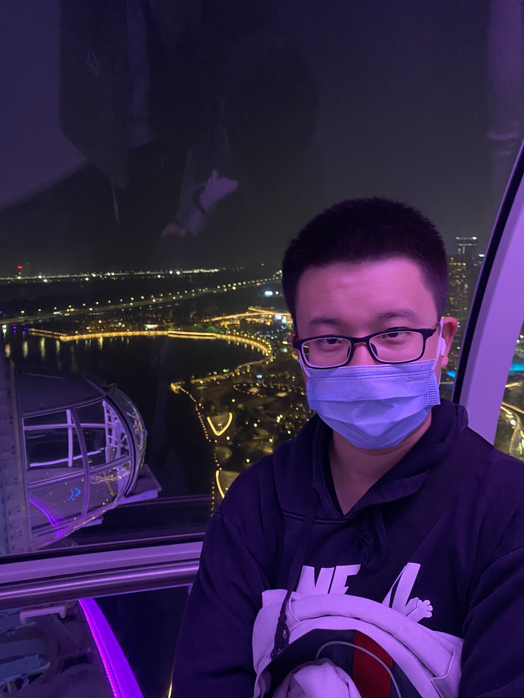

# Yuyang Li



我是李雨阳，目前是上海科技大学硕士研究生，师从 [胡鹏教授](https://bme.shanghaitech.edu.cn/bme_en/2021/0205/c8252a686960/page.htm)。我于 2023 年 7 月获大连东软信息学院计算机科学与技术学士学位。

- **研究方向：** 基于深度学习的端到端心脏 MRI 重建。
- **技术栈：** 熟练使用 C++、Python 与 PyTorch。
- **兴趣方向：** 对 AI Agent 保持持续关注与实践。


---

## 教育经历

* **2023.09 – 2026.07** | **生物医学工程硕士，上海科技大学**，HuLab。
  * *总绩点：* 3.74/4.0 | *专业绩点：* 3.8/4.0
  * *论文题目：* 面向复杂异质数据分布的深度学习 MRI 重建方法研究。

* **2019.09 – 2023.07** | **计算机科学与技术本科，大连东软信息学院**
  * *总绩点：* 3.98/5.0 | *核心课绩点：* 4.02/5.0 | **排名：2/315（前 1%）**
  * *毕业设计：* 基于 YOLOv7 的肺结节医学图像检测算法研究。

## 工作经历

* **2024 年夏季** | **高级生物医学工程创新实践课程助教**，上海科技大学。

## 科研发表

### 会议论文

1. **Y. Li**, Y. Deng, and W. Shang, "MoE-UNet: Using Conditional Sparse Activation to Improve the Capacity of Multi-task End-to-End Reconstruction," in *Proceedings of the 2026 ISMRM & ISMRT Annual Meeting & Exhibition*, **(Accepted)**, May 2026.
2. **Y. Li**, Y. Deng, and W. Shang, "MoRE: Mixture-of-Experts-based Task-Adaptive MRI End-to-End Multimodal Reconstruction," in *Proceedings of the Annual International Conference of the IEEE Engineering in Medicine and Biology Society*, **(Accepted)**, Jul. 2026.

### 挑战赛论文

1. **Y. Li**, Y. Deng, Z. Zhou, and P. Hu, *Branch Learning in MRI: More Data, More Models, More Training*, 2025. arXiv: 2512.20330 [eess.IV]. 链接：[https://arxiv.org/abs/2512.20330](https://arxiv.org/abs/2512.20330).

## 其他经历

### 竞赛

* **2021-07** | **铜奖**，2020 ICPC 亚洲区域赛（沈阳站）。
* **2021-06** | **一等奖**，第 12 届蓝桥杯全国总决赛（C/C++ A 组）。
* **2020-12** | **辽宁省二等奖**，第 12 届全国大学生数学竞赛（非数学类）。
* **2020-11** | **一等奖**，第 11 届蓝桥杯全国总决赛（C/C++ B 组）。
* **2020-10** | **银奖**，第一届辽宁省大学生程序设计竞赛。

### 奖学金与荣誉

* **2020-09** | **三等奖学金**，东软教育。
* **2020-09** | **三好学生**。
